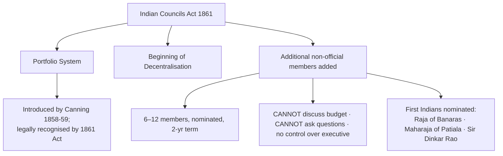
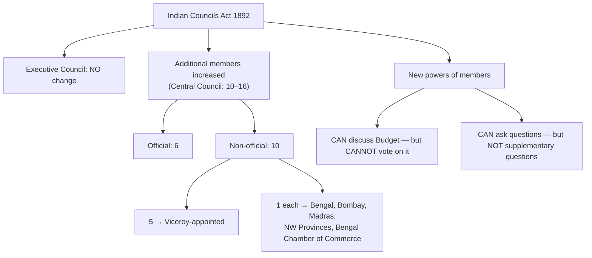

# Rise of Nationalism → Foundation of the INC → Moderates & Extremists → Councils Acts (1861 & 1892)

> **Subject:** Modern History (GS-I Mains + Prelims) · **Theme:** Growth of political
> consciousness & early constitutional development
> **Source:** Adarsh's handwritten notes (digitised, corrected & UPSC-structured)
> **Last updated:** 2026-07-22

---

## 🗺️ Big Picture (how this chapter fits together)

```
Social-reform & regional bodies  →  Pre-Congress political associations
        (local → regional)                    (1836–1884)
                                                    │
                                                    ▼
                          FOUNDATION OF INC (1885)  ── theories of formation
                                                    │
                        ┌───────────────────────────┴───────────────────────┐
                    MODERATES (1885–1905)                        EXTREMISTS (1905–1919)
                                                    │
   Parallel British constitutional response →  Indian Councils Acts 1861 → 1892 → (1909…)
```

**One-line thesis (Bipan Chandra):** The INC was **not a sudden event** and **not** merely
Hume's "safety valve" — it was the **culmination of conscious, sustained efforts** by Indians,
moving from *local → regional → national* political organisation ("**Regional Integration**").

---

## 1. Regional Integration Theory (context)

- From the **early 19th century**, social-reform & literary bodies also did **political
  awakening** through **newspapers, journals & books**.
- These bodies raised **similar issues** → gradually formed **social organisations** → these
  matured into **regional political organisations** → ultimately **culminated into a national
  organisation (INC, 1885)**.
- 💡 *Exam framing:* INC = the **integration of regional political streams** into a single
  national platform. Use this line in any "foundation of Congress" answer.

---

## 2. Pre-Congress Political Associations (1836–1884)

> ⚠️ **High-yield for Prelims** (matching name ↔ founder ↔ year ↔ city). Learn as a table.

### 🅐 Bengal stream (Calcutta)

| Association | Year | Founder(s) / Key figures | Significance |
|---|---|---|---|
| **Bangabhasha Prakashika Sabha** | **1836** | Associates of **Raja Rammohan Roy** | Among the **earliest** political associations |
| **Landholders' Society** (Zamindari Association) | **1838** | **Dwarkanath Tagore**, Raja Radhakant Deb | First organised political effort; guarded **zamindar/landlord** interests |
| **Bengal British India Society** | **1843** | On advice of **George Thompson** | Collect & publish info on real condition of people |
| **British Indian Association** | **1851** | Merger of *Landholders' Society* + *Bengal British India Society* | Dominated by **zamindars**; conservative; published paper *Hindoo Patriot* |

> 🔎 **Don't confuse the three "British India…" bodies:**
> - **British India Society** → **1839, London**, by **William Adam** (+ George Thompson) — to draw the **British public's** attention to despotic rule in India.
> - **Bengal British India Society** → **1843, Calcutta**.
> - **British Indian Association** → **1851, Calcutta** (the merger).

### 🅑 Bombay stream

| Association | Year | Founder(s) | Significance |
|---|---|---|---|
| **Bombay Association** | **1852** | **Jagannath Shankar Seth**, Dadabhai Naoroji | First political association of Bombay; sent petitions re: **Charter Act 1853** |
| **Bombay Presidency Association** | **1885** | **Pherozeshah Mehta, K.T. Telang, Badruddin Tyabji** | The **"Bombay Trio"** |

🧠 **Mnemonic — Bombay Trio = "M-T-T"** → **M**ehta, **T**elang, **T**yabji.

### 🅒 Madras stream

| Association | Year | Founder(s) | Significance |
|---|---|---|---|
| **Madras Native Association** | **1852** | **Gazulu Lakshminarasu Chetty** | Raised **ryotwari peasant** grievances; short-lived |
| **Madras Mahajan Sabha** | **1884** | **M. Viraraghavachariar, G. Subramania Iyer, P. Anandacharlu** | Precursor to INC in the South |

### 🅓 Poona (Maharashtra)

- **Poona Sarvajanik Sabha (1870)** — founders **M.G. Ranade, G.V. Joshi, S.H. Sathe, S.H.
  Chiplunkar** (Ranade the guiding force). Later nurtured **Gokhale & Tilak**.
- **1875:** sent a **petition to the British House of Commons** demanding India's **direct
  representation** in the British Parliament — **signed by >23,000 people**.

### 🅔 England-based & other national bodies

| Body | Year | Founder(s) | Aim |
|---|---|---|---|
| **East India Association** | **1866** | **Dadabhai Naoroji** (in **London**) | Influence **British public opinion** in favour of India |
| **Indian (National) Association** | **1876** | **Surendranath Banerjee & Anand Mohan Bose** (Calcutta) | **First avowedly nationalist** body; aimed to be an **all-India centre**; merged into INC (1886) |
| **National Mohammedan Association** | **1878** | **Syed Amir Ali** | Political voice of Muslims |
| **Indian Parliamentary Committee** | **1893** | **William Wedderburn & W.S. Caine** | Gather support for **Indian political reform** among the British public |

### 🎯 Common demands of these early associations (→ fed into Charter Act 1853 petitions)
1. **Legislation with a popular/representative character**
2. **Separation of executive & judiciary**
3. **Reduction in salaries of high officials** (Indianisation to cut costs)
4. **Abolition of salt duty & stamp duty**

### 🧾 Assessment (Mains value-add)
> **Contribution:** Spread political consciousness · brought educated classes into a political
> fold · critiqued British law & policy · **prepared the ground for the INC**.
> **Limitations:** **narrow social base** · **regional/parochial** outlook · **elite bias**
> (zamindars/professionals) · **imbibed British democratic & constitutional ideas** (worked
> *within* the system).

---

## 3. Foundation of the INC (1885) — Theories of Formation

> 🔥 **Very frequent Mains question:** *"Was the Congress a British safety-valve or a product
> of Indian efforts?"* Structure your answer around these four views.

| Theory | Proponent | Core idea |
|---|---|---|
| **Safety-Valve Theory** | Early view (attributed to **A.O. Hume**'s design) | INC created as a **"safety valve"** to release growing mass discontent & **pre-empt a violent revolt** |
| **Lightning-Conductor Theory** | **G.K. Gokhale** | Nationalists **deliberately** kept **A.O. Hume** (a **white ex-civil servant**) in the lead as a **shield** so the British would **not suppress** the infant Congress; Congress = a **lightning conductor** channelling nationalist forces safely |
| **Conspiracy Theory** | **R.P. Dutt** — *India Today* (**1940**) | Builds on safety-valve; INC born of a **conspiracy** to **abort a popular uprising**; the **bourgeois** leaders were **complacent** partners |
| **Conscious-Efforts (accepted) view** | **Bipan Chandra** | INC = **culmination of decades of conscious Indian effort**; early leaders were **patriots of high character**, **not government stooges** |

🧠 **Memory hook:** **S-L-C-C** → **S**afety-valve → **L**ightning-conductor → **C**onspiracy →
**C**onscious-efforts (the *accepted* one).

> ✍️ **Model conclusion line:** "Thus, the Congress was **not a sudden mushroom growth** but the
> **organised expression of a maturing national consciousness**; Hume was, at most, a
> *lightning-conductor*, not the *creator*."

---

## 4. Moderates vs Extremists (Two phases of the Congress)

| Basis | 🕊️ **Moderates (1885–1905)** | 🔥 **Extremists / Assertive (1905–1919)** |
|---|---|---|
| **Time frame** | 1885–1905 | 1905–1919 |
| **Leaders** | Dadabhai Naoroji, S.N. Banerjee, **Pherozeshah Mehta**, **G.K. Gokhale**, D.E. Wacha | **Lal–Bal–Pal** (Lajpat Rai · Tilak · Bipin Chandra Pal), **Aurobindo Ghosh**, **V.O. Chidambaram Pillai** |
| **Goal / Demand** | **Gradual** constitutional reform; **self-government within the Empire** | **Swaraj** (self-rule) |
| **Methods** | **3 P's – Prayer, Petition, Protest**; constitutional agitation; philanthropy → derided by Extremists as **"political mendicancy" / politics of begging** | **Passive resistance**, boycott, swadeshi, **self-sacrifice**, mass agitation |
| **Attitude to British rule** | Faith in **British sense of justice**; believed in the **"providential mission"** of British rule; **apprenticeship** necessary for political progress | **No faith**; the "providential mission" is **propaganda/illusion**; British rule a **design to further exploitation** |
| **Social base** | **Urban educated elite**, professionals, zamindars — **narrow**; *"lacked faith in the masses"* | **Urban middle class** → drew in **youth & wider masses** |
| **Reform influence** | **Brahmo Samaj** | **Arya Samaj** |
| **Inspiration** | **Western liberal thought** (French & American Revolutions) | **India's own past**, tradition & institutions |
| **View on poverty** | Caused by **India's social & economic structure/policies** | Caused by **British presence** itself |
| **On political reform** | Won through **persuasion / collaboration** | Claimed **as a matter of right** |
| **Mass-mobilisation tools** | Limited | **Ganpati festival (1893)** & **Shivaji festival (1896)** — by **Tilak** |
| **British response** | **Appeasement / "carrots"** (promotions, concessions) | **Repression / "sticks"** (isolation, jail) |

🧠 **Mnemonics:** Extremist trio = **Lal–Bal–Pal**. British approach = **Carrots (Moderates) vs
Sticks (Extremists)**.

> 📌 **Bridge point:** Under **extremist pressure**, the Moderates too sharpened up — raising the
> slogan **"No taxation without representation."**
> **Tilak's line:** *"Political rights will have to be fought for. The Moderates think they can
> be won by persuasion — we think they can be obtained only by strong pressure."*

---

## 5. Indian Councils Act, 1861

> 🎯 **Keyword to remember 1861 = "PORTFOLIO + DECENTRALISATION."**



- **Portfolio system:** each member of the Executive Council given a department (**Military,
  Revenue, Finance, Home, Law** — 1862; **Public Works** added 1874). Introduced by **Canning**,
  recognised by this Act.
- **Ordinance power:** Viceroy could issue **ordinances valid for 6 months**.
- **Decentralisation begins:** reversed the over-centralisation of the **Charter Act 1833**;
  legislative powers **restored to Bombay & Madras**, and new councils set up later in **NW
  Provinces, Punjab & Burma**.
- **Additional (non-official) members** added to the Governor-General's Council for **law-making**
  — but with **very limited powers** (see diagram).
- 📝 **Significance:** *"Marks the beginning of representative institutions"* by associating
  Indians with law-making, and the **beginning of decentralisation** in India.

---

## 6. Indian Councils Act, 1892

> 🎯 **Keyword to remember 1892 = "REPRESENTATION (indirect) + BUDGET DISCUSSION."**



- **Principle of Representation introduced** → **first step towards representative government**.
- **First time — indirect election** (though the word *"election"* was **avoided**: officially
  called **"nomination on the recommendation of certain bodies"** — provincial councils,
  universities, municipalities, zamindars, chambers of commerce).
- **Enlarged functions** of members: could **discuss the budget** and **ask questions** — but
  **could NOT vote on the budget** and **could NOT ask supplementary questions**.

### ⚖️ 1861 vs 1892 — the exam contrast (memorise this)

| Feature | **1861** | **1892** |
|---|---|---|
| Budget | ❌ cannot discuss | ✅ can **discuss** (❌ cannot vote) |
| Questions | ❌ cannot ask | ✅ can **ask** (❌ no supplementary) |
| Members chosen by | Nomination | **Nomination on recommendation** (indirect "election" in disguise) |
| Big idea | **Portfolio + Decentralisation** | **Principle of Representation** |

---

## 🧠 60-Second Last-Minute Revision Box

- **Pre-Congress order (Bengal):** Bangabhasha **1836** → Landholders' **1838** → Bengal British
  India Society **1843** → British Indian Association **1851**.
- **Founders quick-fire:** East India Assoc. → **Dadabhai Naoroji** · Indian Association →
  **S.N. Banerjee + A.M. Bose** · Poona Sarvajanik Sabha → **Ranade** · Bombay Trio → **Mehta,
  Telang, Tyabji** · Madras Mahajan Sabha → **Subramania Iyer, Anandacharlu, Viraraghavachariar**.
- **INC theories:** Safety-valve → Lightning-conductor (**Gokhale**) → Conspiracy (**R.P. Dutt,
  1940**) → Conscious efforts (**Bipan Chandra**, accepted).
- **M vs E:** Moderates = **3 P's, carrots, Brahmo, Western inspiration**; Extremists =
  **Swaraj, sticks, Arya Samaj, Indian past, Lal-Bal-Pal**.
- **Acts:** **1861 = Portfolio + Decentralisation**; **1892 = Representation + Budget discussion**.

---

## 📌 PYQ / Exam-Trend Pointers

**Prelims (fact-matching — very common):**
- Match **association ↔ founder ↔ year** (esp. East India Association–Naoroji; Indian
  Association–S.N. Banerjee; Poona Sarvajanik Sabha–Ranade).
- Powers under the **1861 vs 1892** Acts (budget/questions) — a classic "which statement is
  correct" trap.
- "Who was associated with the *Lightning-Conductor* remark?" → **Gokhale**.

**Mains (GS-I — analytical):**
- *"The early nationalists laid the foundations of the national movement." Discuss.*
- *"Was the Congress a safety valve or a product of India's own political awakening?"*
- *Compare and contrast the ideology & methods of the Moderates and the Extremists.*
- *Constitutional reforms of 1861–1892 were 'too little, too late'. Comment.*

> 🔁 **Next step I can do for you:** pull the **exact-year UPSC + State PSC (UPPSC/BPSC/MPPSC/RPSC)
> PYQs** on these very sub-topics and tag them against each section above.

---

### ✅ Corrections applied while digitising (so your memory is exam-accurate)
- **R.P. Dutt's *India Today*** → published **1940** (notes had 1939).
- **Bombay Presidency Association** → **1885**; **Madras Mahajan Sabha** → **1884** (dates added).
- Distinguished the three easily-confused bodies: **British India Society (1839, London)** vs
  **Bengal British India Society (1843)** vs **British Indian Association (1851)**.
- Moderate phase end / Extremist phase span standardised to **1885–1905** and **1905–1919**.
